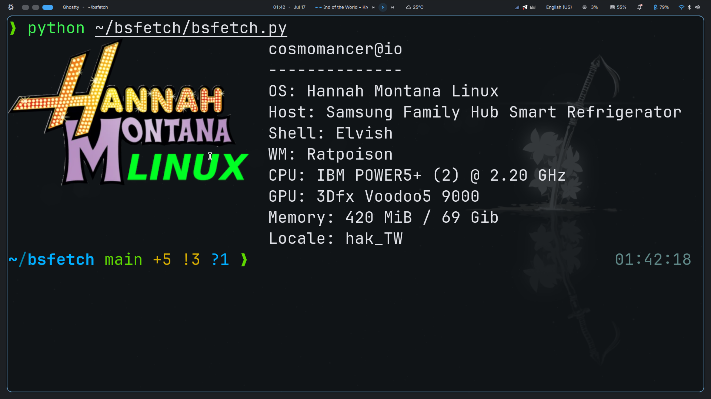

# bsfetch — Fetch BS system information (because why not)



> *"Accurate system info? Never heard of her."*

Are you tired of seeing the same fetch output everyday?
Introducing **bsfetch**!
A fun program for displaying satirical system information. Shock your friends, your colleges and your nerdy cousin with fresh whacky nonsense each time! 

Also while almost all resulting combinations are going to be impossible, the individual software and hardware mentioned here are real and technically usable! The OS listed are all real actual OS that have existed to some degree (enough to have a logo). And the Hosts mentioned are all actual devices capable of running some version of linux to some extent from what i could find on the internet. Go take a look for yourself!

## Features

- System "information" for: operating system, host device, window manager, CPU, GPU and more! With a fresh selection of randomly picked entries for each run!
- Actual username and hostname displayed at the top; Since the information "definitely" belongs to your system.
- A nice (as nice as i could find) looking logo of the chosen operating system displayed using the kitty terminal graphics protocol! (if your terminal of choice supoorts it)
- With more to come... if i have the time and energy.

## Usage

### Clone the repo
```bash
git clone https://github.com/thecosmomancer/bsfetch.git
```

### Install the pypi packages using pip
```bash
pip install -r requirements.txt
```

### Or use the nix flake instead
```bash
nix develop
```

### Run with python
```bash
python bsfetch.py
```

## Goals

- [x] Add a decent amount of entries for the basic catagories
- [x] Add actual username and hostname at the top
- [x] Add logos via the kitty terminal graphics protocol
- [ ] Color the text being prinnted
- [ ] Add more catagories
- [ ] migrate to a "better" language (probably rust) ?

## License

[MIT.](https://choosealicense.com/licenses/mit/) I hate long licensing texts.
