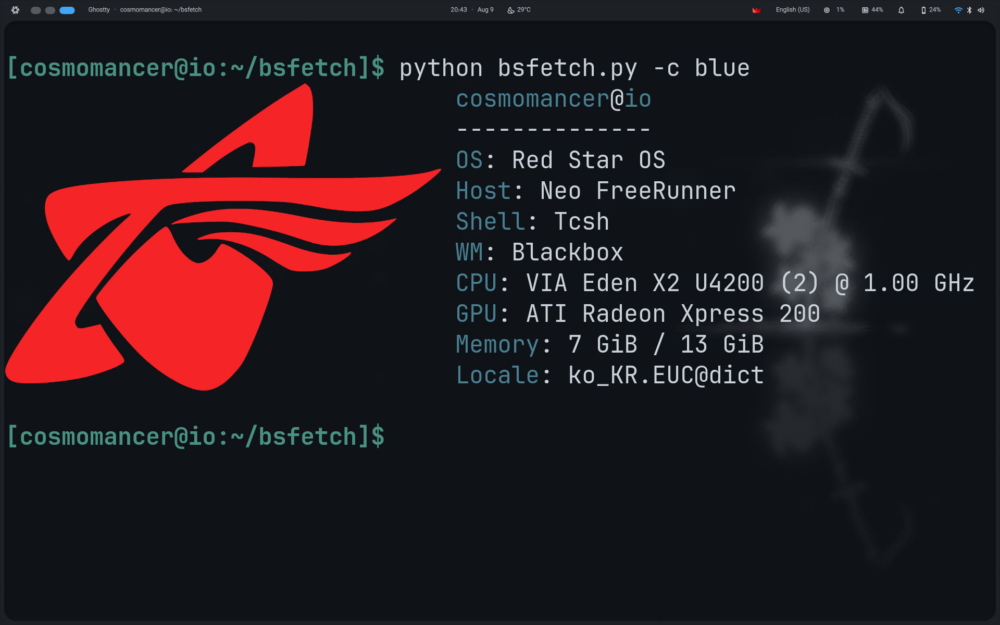

# bsfetch - Fetch BS system information (because why not)



> *"Accurate system info? Never heard of her."*

Are you tired of seeing the same fetch output everyday?
Introducing **bsfetch**!
A fun program for displaying satirical system information. Shock your friends, your colleges and your nerdy cousin with fresh whacky nonsense each time! 

Also while almost all resulting combinations are going to be impossible, the individual software and hardware mentioned here are real and technically usable! The OS listed are all real actual OS that have existed to some degree (enough to have a logo). And the Hosts mentioned are all actual devices capable of running some version of linux to some extent from what i could find on the internet. Go take a look for yourself!

## Features

- System "information" for: operating system, host device, window manager, CPU, GPU and more! With a fresh selection of randomly picked entries for each run!
- Actual username and hostname displayed at the top; Since the information "definitely" belongs to your system.
- A nice (as nice as i could find) looking logo of the chosen operating system displayed using the kitty terminal graphics protocol! (if your terminal of choice supoorts it)
- colored text output for more eye candy, if you're into that stuff.

## Installation

### NixOS

#### Add bsfetch as a flake input

In your system flake's `flake.nix`, add bsfetch to `inputs`:

```nix
inputs = {
  nixpkgs.url = "github:NixOS/nixpkgs/nixos-unstable";
  bsfetch.url = "github:thecosmomancer/bsfetch";
  ...
};
```

#### Import the module in your NixOS configuration

Pass `bsfetch` through to your modules (e.g. via `specialArgs` if using
flakes directly, or however your setup threads flake inputs to modules),
then import it alongside your other modules:

```nix
outputs = { self, nixpkgs, ... }@inputs: {
  nixosConfigurations.yourhostname = nixpkgs.lib.nixosSystem {
    system = "x86_64-linux";
    modules = [
      ./configuration.nix
      inputs.bsfetch.nixosModules.default
      # ...your other modules
    ];
  };
};
```

#### Add the package in your system configuration

Add it to your system packages inside ```environment.systemPackages``` or to your user packages using [home-manager](https://github.com/nix-community/home-manager) by adding it inside of ```home.packages```.

### Other distros

#### Clone the repo
```bash
git clone https://github.com/thecosmomancer/bsfetch.git
cd bsfetch
```

#### Install python3 and the required packages
```bash
pip install -r requirements.txt
```
or using your distro's package manager if global python packages are manged by your distro's package manager.

#### Run the setup script:
```bash
./setup.sh
```
#### If the setup script is not executable:
```bash
bash setup.sh
```

## Usage

```bash
bsfetch -c {color} -W {max-width} -H {max-height}
```
The logo iamge can also explicitly enable with `-l` (requires a terminal that supports the kitty terminal graphics protocol) or disabled with `-L`.

## Development

Besides the main bsfetch.py file, there is also a convert_logo.py script that can be used to convert the logos in the unrefined_logo directory into PNGs that can be used by bsfetch.

### NixOS

use the devshell provided by the flake:

```bash
nix develop
```
This sets the environment variable for the logo directory to the correct path. Python packages needed for using both bsfetch and convert_logo are also included.

### Other distros

Intall the python packages listed in requirements.txt as well as those used by convert_logo (if needed) using your preferred way of installing python packages.

Then set the BSFETCH_LOGO_DIR environment variable to the path of the logo directory before running bsfetch:
```bash
export BSFETCH_LOGO_DIR=/path/to/logo
```

## License

[MIT.](https://choosealicense.com/licenses/mit/) I hate long licensing texts.